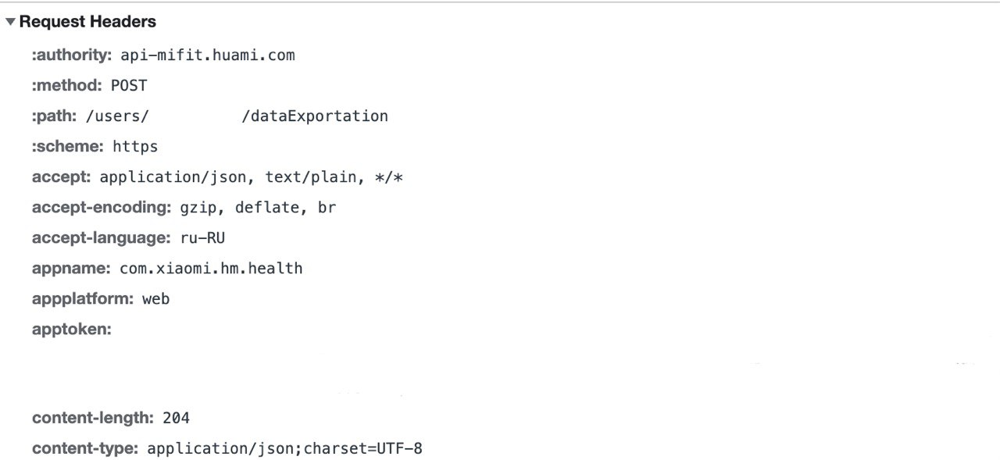

# Mi Fit and Zepp workout exporter

This repository contains an example Python implementation for the [article](https://rolandszabo.com/reverse-engineering/mi-fit/export-mi-fit-and-zepp-workout-data).

## Environment setup
The script depends on the `requests` package.
```bash
pip install -r requirements.txt
```

## Usage
The script downloads all workout data and it also creates corresponding .gpx files for convenience.

```bash
python3 main.py [-h] -t TOKEN [-e ENDPOINT] [-o OUTPUT_DIRECTORY]
```

## Acknowledgements 
The .gpx conversion is based on Miroslav Bendík's [MiFitDataExport](https://github.com/mireq/MiFitDataExport) project.

## How to get a token
This [issue](https://github.com/rolandsz/Mi-Fit-and-Zepp-workout-exporter/issues/6) discussed the problem with the token.
In this issue, there was a suggestion how to get a token through the [web](https://github.com/rolandsz/Mi-Fit-and-Zepp-workout-exporter/issues/6#issuecomment-1146892066)

### Steps to get a token

1. Open this [link](https://user.huami.com/privacy2/index.html?loginPlatform=web&platform_app=com.xiaomi.hm.health&v=4.0.17#/)
2. Choose "Export data"
3. Sign in to your zepp account
4. Again choose "Export data"
5. Open Google inspector
6. Choose `Network`
7. Select any field to export
8. Fill in the email and verification code
9. After completion, you will be taken to the last page with success
10. Explore the `network` and find the process name `dataExportation`
11. Look for the `apptoken` field

</img>