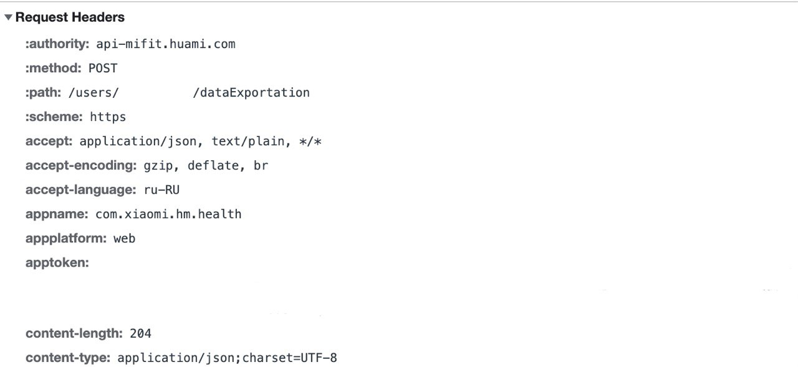

# Mi Fit and Zepp workout exporter

This repository contains an example Python implementation for the [article](https://rolandszabo.com/reverse-engineering/mi-fit/export-mi-fit-and-zepp-workout-data).

## Environment setup
```bash
uv sync
```

## Usage
The script authenticates the user with the API then exports all workouts to the output directory using the specified file format.

```bash
python3 main.py [-h] [-e ENDPOINT] [-t TOKEN] [-f {gpx,geojson,gpkg,parquet,shp,csv,json,xlsx,sql,xml,html}] [-o OUTPUT_DIRECTORY]
```

## Acknowledgements 
The latitude/longitude parsing is based on Miroslav Bendík's [MiFitDataExport](https://github.com/mireq/MiFitDataExport) project.

## How to get the token manually
If the authentication does not work out of the box, you can also provide the token manually:

1. Open the [GDPR page](https://user.huami.com/privacy2/index.html?loginPlatform=web&platform_app=com.xiaomi.hm.health)
2. Click `Export data`
3. Sign in to your account
4. Open the developer tools in your browser (F12)
5. Select the `Network` tab
6. Click on `Export data` again
7. Look for any request containing the `apptoken` header or cookie
8. Pass the token to the script using the `-t` argument

</img>
